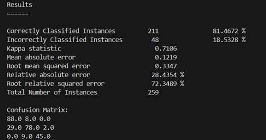

# Sales of Summer Clothes in E-commerce Wish

This repository contains the code and documentation for the data mining project titled "Sales of Summer Clothes in E-commerce Wish" as part of the Data Mining course at Vietnam International University - Ho Chi Minh City. The project involves data pre-processing, analysis, and prediction using machine learning algorithms.

## Table of Contents

1. [Introduction](#introduction)
2. [Data Pre-processing](#data-pre-processing)
    - [Data Cleaning](#data-cleaning)
    - [Data Analysis](#data-analysis)
3. [Prediction Algorithms](#prediction-algorithms)
4. [Model Evaluation](#model-evaluation)
    - [Naive Bayes Evaluation Results](#naive-bayes-evaluation-results)
    - [Random Forest Evaluation Results](#random-forest-evaluation-results)
    - [Comparison](#comparison)
5. [Conclusion](#conclusion)
6. [References](#references)

## Introduction

In recent years, e-commerce platforms have emerged as a significant disruptor, transforming traditional physical transactions into online interactions. This shift is particularly noticeable in the developing world, where entrepreneurs are leveraging these platforms to optimize their businesses, accelerate development, and access new market segments.

Understanding how markets operate is a critical component of planning an effective business model. The supply and demand theory posits that price is the primary factor driving the quantity sold, assuming other variables remain constant. Therefore, examining how markets interact to achieve maximum sales and profit is essential.

Given this context, our group has selected the dataset "Sales of Summer Clothes in E-
commerce Wish" for our project. This dataset comprises 43 columns, containing product listings, product ratings, and sales performance metrics.

## Data Pre-processing

### Data Cleaning

1. **Dropping Unnecessary Columns**: Removed irrelevant columns from the dataset.
2. **Removing Duplicate Columns**: Eliminate duplicate columns to avoid redundant information.
3. **Handling Missing Values**: Addressed missing values by filling numerical values with the mean and categorical values with the most frequent value or 'Unknown'.
4. **Normalizing**: Standardized values in categorical columns to ensure consistency.
5. **Normalizing Color Variations**: Standardized color names and created binary columns for color representation.

### Data Analysis

- Created visualizations to analyze units sold distribution, rating distribution, and price distribution.

- Used box plots to compare rating distributions across different sales categories.

## Prediction Algorithms

The following section provides an in-depth examination of the implementation of the prediction of `Unit_Sold` Java class, which leverages the Weka library to classify product ratings. The primary objective is to categorize products into three groups: "slow," "stable," and "hot," based on their attributes. Various algorithms were evaluated, including Decision Tree, SMO, and Linear Regression, but Naive Bayes and Random Forest demonstrated the highest accuracy.

### Implementation Steps

1. **Loading the Dataset**: Import the dataset from the specified ARFF file into an Instances object.
2. **Calculating Quartiles**: Determine thresholds for categorizing sales performance.
    - Q1 (First Quartile): Represents the 25th percentile of the units_sold data.
    - Q3 (Third Quartile): Represents the 75th percentile of the units_sold data.
3. **Creating Nominal Attribute**: Create `units_sold_categories` to classify products based on sales performance.
4. **Updating Class Index**: Add the `units_sold_categories` attribute to the dataset and update the class index.
5. **Categorizing Instances**: Classify each instance based on the value of the `units_sold` attribute.
    - "Slow": Instances with units_sold values ≤ Q1.
    - "Stable": Instances with units_sold values > Q1 but ≤ Q3.
    - "Hot": Instances with units_sold values > Q3.

    
6. **Removing Original Attribute**: Remove the original `units_sold` attribute to streamline the dataset.
7. **Randomizing and Splitting Dataset**: Divide the dataset into training (80%), test (20%), and validation (10 instances) sets.

### Algorithm Implementation

- **Naive Bayes**: Train on the training set, then predict the categories of instances in the test and validation sets. Evaluate the performance based on accuracy and other metrics.
- **Random Forest**: Train on the training set, then predict the categories of instances in the test and validation sets. Evaluate the performance based on accuracy and other relevant metrics.

Overall, the Random Forest algorithm outperformed the Naive Bayes algorithm in accuracy and overall performance metrics.

## Model Evaluation

### Naive Bayes Evaluation Results

- Achieved an accuracy of 81.4672%
- Kappa Statistic: 0.7106
- Mean Absolute Error (MAE): 0.1219
- Root Mean Squared Error (RMSE): 0.3347
- Runtime: 15 seconds

### Random Forest Evaluation Results

- Achieved an accuracy of 85.7143%
- Kappa Statistic: 0.7777
- Mean Absolute Error (MAE): 0.1194
- Root Mean Squared Error (RMSE): 0.2444
- Runtime: 15 seconds

### Comparison

The Random Forest model outperformed the Naive Bayes model in terms of accuracy, Kappa statistic, and error rates. However, Naive Bayes had a shorter runtime for both training and prediction.

## Conclusion

Based on the evaluation, the Random Forest algorithm outperforms the Naive Bayes algorithm in several aspects:
- **Accuracy**: Random Forest achieved an accuracy of 85.7143%, higher than the 81.4672% achieved by Naive Bayes.
- **Kappa Statistic**: The Kappa statistic for Random Forest (0.7777) is higher than that for Naive Bayes (0.7106), indicating better agreement between predicted and actual classifications.
- **Error Rates**: Random Forest has lower Mean Absolute Error (0.1194 vs. 0.1219) and Root Mean Squared Error (0.2444 vs. 0.3347), reflecting more accurate predictions.
- **Confusion Matrix**: Random Forest shows fewer misclassifications across the classes compared to Naive Bayes.

Overall, the Random Forest algorithm is the better model for this prediction task, offering higher accuracy and better overall performance metrics.

## References

1. Chittawar, P. (n.d.). Summer clothing sales prediction [Kaggle notebook]. Retrieved May 25, 2024, from [Kaggle](https://www.kaggle.com/code/parthchittawar/summer-clothing-sales-prediction)
2. Ziegler, A., & König, I. R. (2014). Mining data with random forests: current options for real-world applications. Wiley Interdisciplinary Reviews: Data Mining and Knowledge Discovery, 4(1), 55-63.
3. Singh, S. N., & Sarraf, T. (2020, January). Sentiment analysis of a product based on user reviews using random forests algorithm. In 2020 10th International conference on cloud computing, data science & engineering (Confluence) (pp. 112-116). IEEE.
4. Huang, J., Lu, J., & Ling, C. X. (2003, November). Comparing naive Bayes, decision trees, and SVM with AUC and accuracy. In Third IEEE International Conference on Data Mining (pp. 553-556). IEEE.
5. Youn, E., & Jeong, M. K. (2009). Class-dependent feature scaling method using naive Bayes classifier for text data mining. Pattern Recognition Letters, 30(5), 477-485.
6. Jiang, L., Wang, D., Cai, Z., & Yan, X. (2007). Survey of improving naive bayes for classification. In Advanced Data Mining and Applications: Third International Conference, ADMA 2007 Harbin, China, August 6-8, 2007. Proceedings 3 (pp. 134-145). Springer Berlin Heidelberg.
